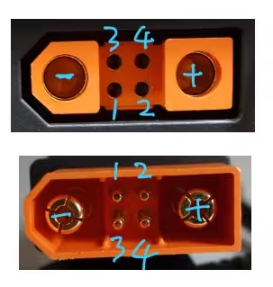

# DJI_SDC_ReverseEngineer
Reverse engineer on DJI SDC ports.

## SDC port
The SDC port is very similar to the Amess XT120 connector with minor difference on plastics. 
With 2 main connector for high power path and 4 signal pins.
The two power pins are 5.5mm barrel connector and 4 signal pins are 2mm.

We use the same way Amess used to number the signal pins:

There are no GND on signal pins, all voltage reference to the main Negative pin.

Pin functions as bellow:

1. +5V VCC: Provide power to peripheral device. Provide external 5V will wake up the DJI Power (MPPT charging module will do this.)
2. ID: Analog input with internal 10KΩ pull up to 3.3V
3. SCL or TxD: For charging drone battery using SMBUS it's SCL; For other devices it's serial TxD
(Tx from Power unit, Rx of peripheral device)
4. SDA or RxD

Both pin 3 and 4 are 3.3V Logic.

## ID pin

Power unit have internal pull up resistor. The device connected should have a pull down resistor to GND. 
This can be tested easily using a multi-meter.

So far the known resistors are:

* 1K Charger, MPPT and car charger seem both using 1K. pin 3 and 4 will be in serial port communicating with the charger. 

* 2.2K This is used for SMBUS drone battery charging. On the drone battery side the pull down resistor will be connected to GND. Thus when the cable is only attached to power unit without the drone battery the screen will not show anything, because the pull down resistor is floating on the other side.
When battery is connected, the 2.2K pull down is complete. The pin 3 and 4 will be in SMBUS mode. reading the battery info and start charge the drone battery.

    Note. Not all drone battery use SMBUS to communicate. Some drone battery using serial port.Those battery charging cable may use a different ID resistor. If you have such cable, welcome to share the value you measured.

* 12K This resistor will directly put the SDC in 12V output. The SDC to XT60 or car power is using this. No digital communication needed.

* 18K Similar to 12V, instead the output voltage is 24V

* 45K Extension battery pack. Also serial port.

## Serial Port Protocol

When pin 3 and 4 are in serial port mode. the parameter is: 115200 8N1

The data frame is variable length. All following information is from reverse engineering and may not be accurate. Below bytes index starts from 0.

Byte 0 is always 0x55 indicate the frame starts. 

Byte 1 is length, indicate how many bytes in this frame. (Including the start byte and length byte) 

Byte 2 seems always 0x04. I name it as Class_A

Byte 3 is Class_B

Byte 4 is Talker

Byte 5 is Listener

Byte 6 7 is sequence number: This 16 bits little endian number seems only growing. It may skip a number but only increasing. start from 0x0001 on power unit power on. The Tx and Rx frame seems have the same sequence number to indicate this is the reply of which frame.

Byte 8 is Direction: so far only 3 possible observed:

    0x40 is a frame sent from power unit

    0x80 is a frame sent to the power unit

    0x00 only observed on few cases, seems to be a boardcast type of message

Byte 9 is 0x00 on initial handshake and 0x5A there after. 

Then the payload bytes here. variable length.

The last two bytes are checksum. CRC16. 

## Some decoded frames

### Class_B == 0x20:

This frame observed when 3 port MPPT is connected and sent to power unit as reply of 0x38 frame. 

Byte 12 13 are voltage. Unit is x0.01V

Byte 14 15 are current. unit is x0.01A

### Class_B == 0x2D:

Frame from expansion battery to power unit. 

Byte 77 78 are pack voltage in mV. 

Byte 85 86 are int16 pack current in mA. Positive is charging the battery pack. 

Byte 97 to 128 are 16 uint16 of single cell voltage. x0.01V

### Class_B == 0x38:

Similar to above 0x20 frame, but is sent from power unit.

Power unit will send this frame first and MPPT will reply with the same sequence number and same voltage current. 

Guessing this is the power unit update the max allowed voltage and current the charger can output. And above 0x20 is reply from charger the numbers are set. 

### Class_B == 0x66:

Power unit request information from MPPT module. 

### Class_B == 0x9C:

MPPT reply to power unit 0x66 request. 

Byte 16 17 are output voltage. This is the number shown on LCD. 

Byte 18 19 are current. 

Byte 20 21 unknown. 

Byte 22 23 seems to be the max input voltage. 
(On 3 port MPPT module this is the highest port voltage on the 3 ports. 
Also is the port used to charge the battery.)

Byte 24 is how many inputs available (0, 1, 2, 3 on 3 port MPPT module). 

Byte 25 indicate charging or not (0x00 when current is 0; 0x01 when charging). 

Byte 26 27 are input power x0.1W. This is the number shown on LCD. 

Byte 28 29 are temperature x0.1. 

Byte 30 31 are MPPT first input port voltage. 

Byte 32 33 are second port voltage. 

Byte 34 35 are third port voltage. 

### Class_B == 0xFC:

Frame sent to expansion battery. 

Byte 17 bit 0 seems indicate the LCD screen on/off. 
